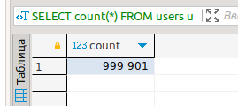
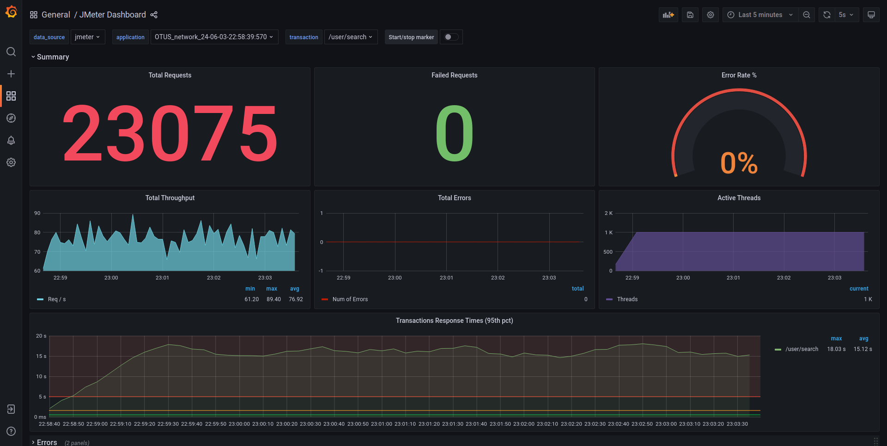
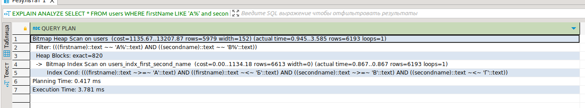
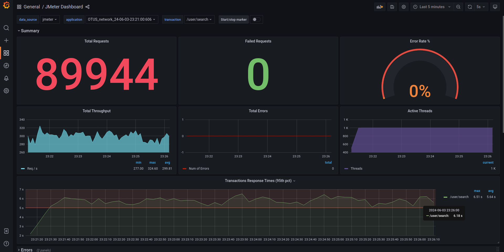

# Индексы: оптимизация запросов // ДЗ

В БД импортированы тестовые данные из предложенного источника



Проведены нагрузочные тесты для метода /user/search c 10/100/1000 одновременных пользователями.
## 10

## 100

## 1000


## Индекс
Создан составной индекс на firstname и secondname, в соответствии с форматом поиска:
```sql
create index users_indx_first_second_name on users (firstname text_pattern_ops, secondname text_pattern_ops);
```
EXPLAIN ANALIZE запроса после создания индекса


Проведены нагрузочные тесты после создания индекса для метода /user/search c 10/100/1000 одновременных пользователями.
## 10

## 100

## 1000
